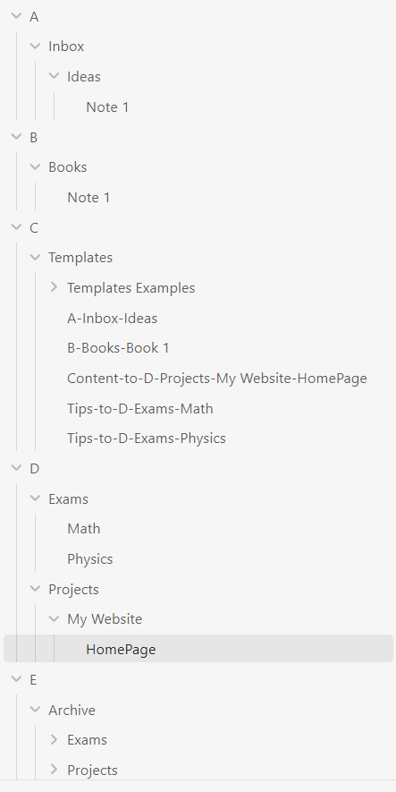
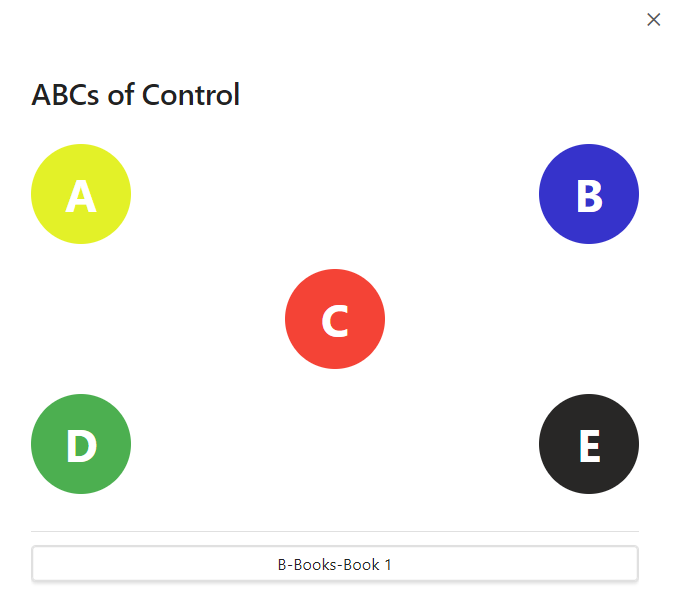
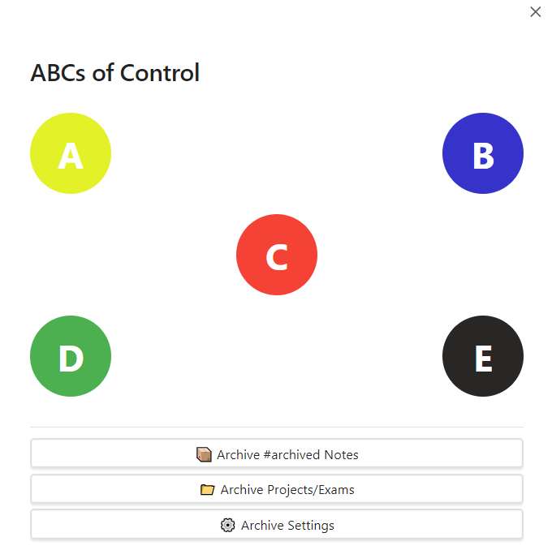

# ABCs of Control

[](https://github.com/sponsors/waheed11)
[](https://buymeacoffee.com/waheed11)

A powerful Obsidian plugin that implements the ABCs framework for knowledge management and productivity. Organize your vault into distinct zones (A, B, C, D, E) with intelligent templates, automated workflows, and seamless content insertion.

## ✨ Features

### 📁 Intelligent Folder Organization
- **A (Permanent Notes)**: Evergreen knowledge, contacts, prompts, quotes
- **B (Literature Notes)**: Articles, books, videos, meeting notes
- **C (Templates)**: Reusable templates for creation and content insertion
- **D (Active Work)**: Projects, exams, current work in progress
- **E (Archive)**: Completed work with auto-archiving capabilities

### 🎯 Two Types of Templates

#### Creation Templates
Create new notes instantly with structured frontmatter and sections:
- **A-Inbox-Ideas**: Capture new ideas with context
- **A-Contacts**: Store contact information
- **A-Permanent Notes**: Evergreen knowledge notes
- **B-Literature Notes**: Articles and video summaries
- And more...

#### Insertion Templates
Insert content from your vault notes into structured project files:
- **Content-to-D-Projects-[Project Name]**: Organize project content with hierarchical headings
- **Tips-to-E-Exams-[Exam Name]**: Collect exam preparation materials
- Supports numbered headings (1, 1.1, 1.1.1) for automatic ordering
### 🚀 Key Capabilities

- **Template Examples Auto-Creation**: 11+ example templates created automatically in `C/Templates/Templates Examples/`
- **Smart Content Insertion**: Link vault notes and add custom text to target files
  - **Note Search**: Find and insert notes from anywhere in your vault
  - **Archive Management**: Auto-archive notes by age or #archived tag
  - **Multi-Language Support**: English and Arabic with RTL support
  - **Customizable Pipelines**: Configure your own template prefixes and workflows
  - **Text Highlighting**: Context menu for quick highlighting and quote extraction
## 📸 Screenshots

<p align="center">
  
</p>
<p align="center"><em><strong>ABCs folder structure.</strong> Templates live in <code>C/Templates/</code>; Active work in <code>D</code>; Archives in <code>E</code>.</em></p>
    
<p align="center">
      
    </p>
    <p align="center"><em><strong>Create A notes from templates.</strong> Launch creation templates like <code>A-Inbox-Ideas</code> to quickly capture structured notes.</em></p>
    
  <p align="center">
      
    </p>
    <p align="center"><em><strong>Create B literature notes.</strong> Example: <code>B-Books-Book 1</code> for reading notes.</em></p>
    
  <p align="center">
      
    </p>
    <p align="center"><em><strong>Insertion templates.</strong> Use <code>Content-to-…</code> or <code>Tips-to-…</code> to insert notes under numbered headings.</em></p>
    
  <p align="center">
      
    </p>
    <p align="center"><em><strong>Archive tools (E).</strong> One-click archiving by tag or by age, with preview and selection controls.</em></p>
    
  ## 📦 Installation
    
  ### From Obsidian Community Plugins (Recommended)
  1. Open Obsidian Settings
  2. Go to Community Plugins → Browse
  3. Search for "ABCs of Control"
  4. Click Install, then Enable
    
    ### Manual Installation
1. Download the latest release from [GitHub Releases](https://github.com/waheed11/ABCs-of-control/releases)
2. Extract `main.js`, `manifest.json`, and `styles.css` to your vault's `.obsidian/plugins/abcs-of-control/` folder
3. Reload Obsidian
4. Enable "ABCs of Control" in Settings → Community Plugins

### First Run
On first activation, the plugin automatically:
1. Creates `C/Templates/` folder
2. Populates `C/Templates/Templates Examples/` with 11 example templates
3. Sets up default pipelines for content insertion

### Using the Plugin
1. **Open ABCs Modal**: Click the ABCs logo ribbon icon (A/B/C/D/E) or use command palette → "Start ABCs of Control"
2. **Browse Templates**: Navigate through letters A, B, C, D, E
3. **Select a Template**: Click to activate creation or insertion workflow

### Template Workflow

#### Creation Templates (A, B folders)
1. Select a creation template (e.g., "A-Inbox-Ideas")
2. Fill in the prompted values (e.g., tags, title, description)
3. Note is created in the corresponding folder automatically

**Example**: `A-Inbox-Ideas` creates notes in `A/Inbox/Ideas/`

#### Insertion Templates (Content-to-D, Tips-to-E)
1. Select an insertion template (e.g., "Content-to-D-Projects-WebDev")
2. Choose target heading from the project blueprint
3. Search and add notes from your vault OR write custom text
4. Click "Insert" - content appears under the selected heading

**Example**: `Content-to-D-Projects-WebDev-Content` inserts into `D/Projects/WebDev/Content.md`

### Template Naming Convention

**Creation Templates**: `[Letter]-[Folder]-[Subfolder]`
- Example: `A-Inbox-Ideas`, `B-Literature Notes-Articles`

**Insertion Templates**: `[Prefix]-[Folder]-[Subfolder]-[Filename]`
- Example: `Content-to-D-Projects-MyProject`, `Tips-to-E-Exams-Math101`
- Default prefix: `Content-to-` (customizable in settings)

## ⚙️ Configuration

Access settings via Settings → ABCs of Control

### Role Folder Mapping
Configure which folders correspond to each ABC role:
- **A Folders**: Permanent notes locations (default: `A`)
- **B Folders**: Literature notes locations (default: `B`)
- **C/Templates**: Fixed location for templates (cannot be changed)
- **D Folder**: Root for active work (sub-folders managed by pipelines)
- **E/Archive**: Fixed location for archived notes

### Pipeline Configuration
Customize content insertion workflows:
- **Template Prefix**: Set custom prefix (e.g., `Content-to-`, `Notes-to-`)
- **Target Path**: Automatically derived from template name
- **Include Archive**: Toggle archived notes in search results
- **Add New Pipeline**: Create custom pipelines for your workflows

### Archive Settings
- **Archive Now**: Move all notes tagged with `#archived` to E/Archive
- **Archive Settings**: Configure auto-archiving based on note age
- **Preview before archiving**: Review and select which notes to archive

### Other Settings
- **Default Highlight Color**: Choose from Yellow, Green, Red, Blue, Gray
- **Default Language**: English or Arabic (with RTL support)

## 📚 Creating Custom Templates

### Step 1: Copy Examples
Copy any template from `C/Templates/Templates Examples/` to `C/Templates/` to activate it.

### Step 2: Customize Structure
**For Creation Templates** (A, B):
```markdown
---
type: your-type
status: 
tags:
  - {{VALUE:tag prompt}}
---

## Section Name:
{{VALUE:Prompt for user input}}
```

**For Insertion Templates** (Content-to, Tips-to):
```markdown
---
type: project
---
# 1 Phase One
## 1.1 Sub-phase One
## 1.2 Sub-phase Two

# 2 Phase Two
## 2.1 Sub-phase One
```

### Step 3: Use {{VALUE:}} Syntax
Any text following `{{VALUE:}}` will prompt the user for input:
- `{{VALUE:Enter project name}}` → Prompts: "Enter project name"
- `{{VALUE:tags}}` → Prompts: "tags"

## 🎨 Use Cases

### Knowledge Management
- Capture permanent notes with structured templates
- Link literature notes to projects
- Build interconnected knowledge graphs

### Project Organization
- Break down projects into hierarchical phases
- Collect relevant notes under each phase
- Track progress with structured content files

### Exam Preparation
- Create exam blueprints with topic hierarchy
- Gather study materials under each topic
- Review notes organized by exam sections

### Content Creation
- Plan YouTube videos or blog posts
- Organize research and references
- Build content outlines with linked notes

## 🛠️ Development

### Building from Source
```bash
# Clone the repository
git clone https://github.com/waheed11/ABCs-of-control.git
cd ABCs-of-control

# Install dependencies
npm install

# Build for production
npm run build

# Build and deploy to test vault
npm run build:deploy
```

### Project Structure
```
src/
├── main.ts              # Plugin entry point
├── types.ts             # TypeScript interfaces
├── constants.ts         # Configuration constants
├── settings.ts          # Settings tab
├── templateExamples.ts  # Template definitions
├── utils.ts             # Utility functions
├── modals/              # Modal windows
└── handlers/            # Feature handlers
```

## 📄 License

MIT License - see LICENSE file for details

## 🙏 Acknowledgments

Built with the Obsidian Plugin API. Inspired by the ABCs method for knowledge organization and productivity.

## ❤️ Support

If this plugin saves you time, consider supporting development:

- GitHub Sponsors: https://github.com/sponsors/waheed11
- Buy Me a Coffee: https://buymeacoffee.com/waheed11

## 📞 Support & Feedback

- **Issues**: [GitHub Issues](https://github.com/waheed11/ABCs-of-control/issues)
- **Discussions**: [GitHub Discussions](https://github.com/waheed11/ABCs-of-control/discussions)
